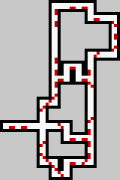
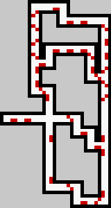
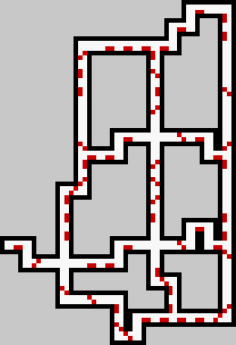

# Procedural Dungeon Generator

Simple prototype python code for a two-layer procedural dungeon generation algorithm

## Algorithm Description

The algorithm takes as input a set of rooms (which are images in this implementation) which each have some number of entrances and exits (red pixels in the image in this implementation). It also takes in as input an overall architectural design for the dungeon (the NodeMap.png file), which tells the algorithm how to organize these rooms. The algorithm then iterates through the architechtural design (layer 1) and randomly selects rooms that fit the base layer design (layer 2) while also making sure to match the locations of entrances and exits of the rooms. If it does not find a valid room, the algorithm will backtrack and try again with different rooms.

## Example Dungeons generated

## Example Creation Gif

## Example Node Map with Created Dungeon

## Requirements

 - Python 3.7+
 - Pillow, the Python Imaging Library
